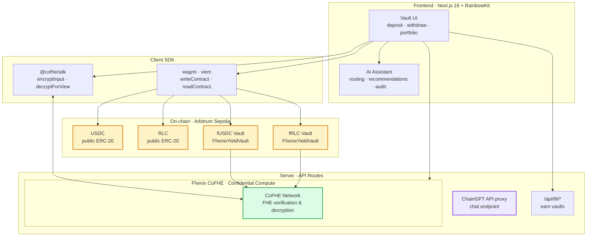
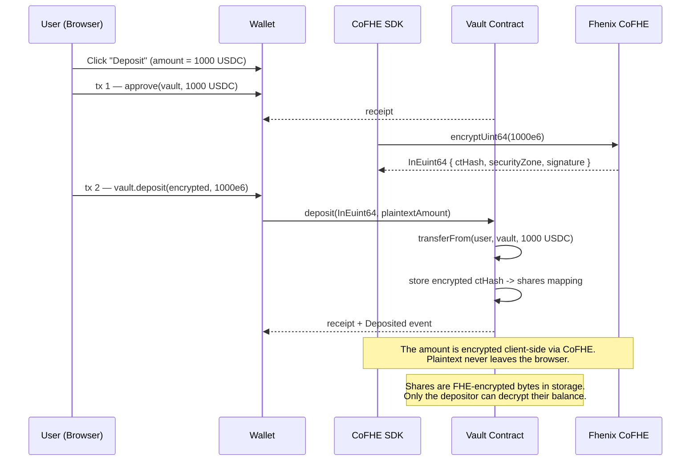
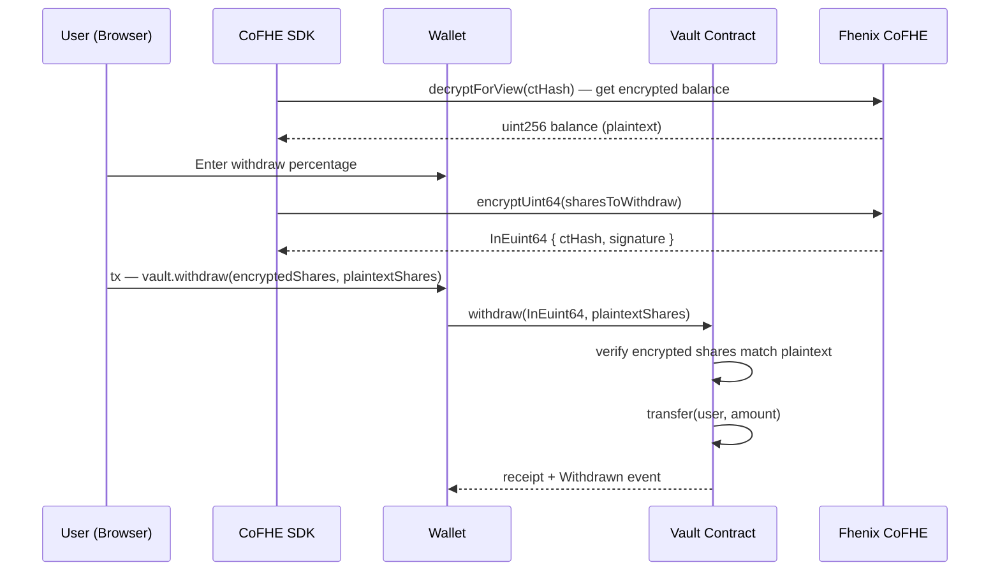

<div align="center">


# eNIX App — Confidential Yield Vault Aggregator

*Confidential yield farming powered by Fhenix CoFHE & FHE encryption, with AI-assisted vault routing.*

[](https://fhenix.io)
[](https://sepolia.arbiscan.io)
[](LICENSE)

</div>

---

## Table of Contents

- [The Problem](#the-problem)
- [The Solution](#the-solution)
- [Real-World Use Cases](#real-world-use-cases)
- [System Architecture](#system-architecture)
- [Deposit Flow](#deposit-flow)
- [Withdraw Flow](#withdraw-flow)
- [Live on Arbitrum Sepolia](#live-on-arbitrum-sepolia)
- [Technical Deep Dive](#technical-deep-dive)
- [Tech Stack](#tech-stack)
- [Repository Structure](#repository-structure)
- [Getting Started](#getting-started)
- [Threat Model](#threat-model)
- [Feature Status](#feature-status)
- [Roadmap](#roadmap)
- [Team](#team)
- [References](#references)
- [License](#license)

---

## The Problem

Yield farming lacks privacy. Every position, balance, and strategy is visible on-chain — exposed to MEV bots, copy-traders, and on-chain analytics. Unlike traditional finance, there is no private yield optimization onchain.

- **Searchable** — on-chain analytics tools expose entire yield portfolios.
- **Linkable** — combined with wallet activity, exposes wealth profile.
- **Copy-traded** — strategies get cloned by MEV bots.
- **Permanent** — every deposit/withdraw is permanent on-chain.

The net effect: **large yield farmers become targets for MEV extraction, while privacy-conscious users have no confidential yield options.**

## The Solution

**eNIX App** is a confidential yield vault aggregator where:

- ✅ **Anyone can deposit** USDC or RLC into confidential vaults.
- ✅ **Depositors receive FHE-encrypted shares** — balances are encrypted on-chain via Fhenix CoFHE.
- ✅ **Per-depositor amounts are cryptographically hidden** — FHE ensures no one but the depositor can decrypt their balance.
- ✅ **The aggregate TVL stays publicly verifiable** — vault transparency is preserved with live TVL display.
- ✅ **Yield accrues on encrypted balances** — ERC-4626-style vault logic applied to FHE-encrypted assets.
- ✅ **Vault recommendations are AI-assisted via ChainGPT** — routing, APY comparison, risk analysis.

> **Key insight:** FHE (Fully Homomorphic Encryption) lets the vault compute on encrypted data directly. No TEE needed — the math itself guarantees privacy.

## Real-World Use Cases

| Use Case | Why Confidentiality Matters |
| --- | --- |
| **Institutional investors** | Large positions attract MEV extraction and copy-trading. |
| **Whale wallets** | Public exposure leads to targeting by scammers and social engineering. |
| **Family offices** | Privacy for wealth management strategies. |
| **Treasury operations** | Corporate treasury positions should not be public. |
| **VC funds** | Investment strategies stay confidential. |
| **High-net-worth individuals** | Do not want on-chain visibility of holdings. |

In every case, **public verification of TVL** is essential (depositors need to trust the vault), but **public attribution of individual deposits** is harmful.

---

## System Architecture



- **ChainGPT** — proxied server-side so the API key is never shipped to the browser.

## Deposit Flow



What happens:

1. **Approve.** Standard ERC-20 `approve(vault, amount)` — the vault needs permission to pull tokens.
2. **Encrypt.** The CoFHE SDK encrypts the deposit amount into an `InEuint64` struct using the user's FHE key. The plaintext never leaves the browser.
3. **Deposit.** The vault contract transfers ERC-20 tokens from the user and stores the encrypted balance mapping.

## Withdraw Flow



---

## Live on Arbitrum Sepolia

All contracts are **deployed** on Arbitrum Sepolia:

| Component | Address | Arbiscan |
| --- | --- | --- |
| **USDC** (testnet ERC-20) | `0x75faf114eafb1BDbe2F0316DF893fd58CE46AA4d` | [view](https://sepolia.arbiscan.io/address/0x75faf114eafb1BDbe2F0316DF893fd58CE46AA4d) |
| **RLC** (testnet ERC-20) | `0x9923eD3cbd90CD78b910c475f9A731A6e0b8C963` | [view](https://sepolia.arbiscan.io/address/0x9923eD3cbd90CD78b910c475f9A731A6e0b8C963) |
| **fUSDC Vault** (FhenixYieldVault) | `0x6d4d017dE8d0A36dce7856Ee989624C6A18cD9Ea` | [view](https://sepolia.arbiscan.io/address/0x6d4d017dE8d0A36dce7856Ee989624C6A18cD9Ea) |
| **fRLC Vault** (FhenixYieldVault) | `0xD04A92C83AFe71f4f69F9FAD0A33229BFBdE33E6` | [view](https://sepolia.arbiscan.io/address/0xD04A92C83AFe71f4f69F9FAD0A33229BFBdE33E6) |

---

## Technical Deep Dive

### Layer 1 — Smart Contracts (`/foundry/src`)

| Contract | Responsibility |
| --- | --- |
| `FhenixYieldVault.sol` | ERC-4626-style vault accepting `InEuint64` encrypted deposits. Stores encrypted balances via CoFHE. |
| `DeployFhenixVaults.s.sol` | Foundry deploy script. Deploys two vaults (fUSDC, fRLC) and logs addresses. |

The vault contract:
- Accepts `InEuint64 encryptedAmount` (FHE-encrypted) + `uint256 plaintextAmount` (for ERC-20 transfer)
- Stores encrypted per-user balances as `ctHash -> shares` mappings
- Computes totalAssets from totalSupply (1:1 share-to-asset ratio for MVP)
- Tracks yield via `depositYield()` — yields are plaintext ERC-20 transfers (confidential yield is a Phase 2 feature)
- Exposes `encryptedBalanceOf(user)` → returns ctHash for client-side decryption

### Layer 2 — Fhenix CoFHE Integration

Three CoFHE primitives are used:

1. **Encrypt.** `cofheClient.encryptInputs([Encryptable.uint64(amount)])` — encrypts the deposit/withdraw amount client-side. The InEuint64 struct is sent as a transaction argument.
2. **Decrypt.** `cofheClient.decryptForView(ctHash, FheTypes.Uint64)` — decrypts the user's balance for display. Requires a self-permit (gasless signature).
3. **Permits.** `cofheClient.permits.getOrCreateSelfPermit()` — grants the user permission to decrypt their own ciphertexts.

The CoFHE client is initialized with `createCofheClient()` and connected to the user's wagmi viem clients.

### Layer 3 — ChainGPT AI Integration

Each app page has a floating AI chat button that opens a sheet. The chat is proxied server-side via `POST /api/chaingpt` using the ChainGPT `general_assistant` model.

The endpoint is wrapped as a Next.js Route Handler server-side so the API key is never shipped to the browser.

### Layer 4 — Frontend (`/src`)

- **Framework:** Next.js 16 (App Router) + React 19 + TypeScript strict mode
- **Wallet:** RainbowKit 2.2 + Wagmi 2.19 + Viem 2.48
- **Styling:** Tailwind CSS v4 + react-icons + motion (Framer Motion)
- **State:** TanStack Query 5 (server) + Zustand (client)
- **Confidential UX:** integrated deposit/withdraw flow via `@cofhe/sdk`
- **Off-chain index:** read-only via on-chain views
- **LI.FI integration:** general earn vaults (non-confidential) alongside Fhenix vaults

---

## Tech Stack

```text
Smart Contracts ┃ Solidity ^0.8.28, Foundry, OpenZeppelin v5, Fhenix CoFHE
FHE SDK         ┃ @cofhe/sdk (encrypt, decrypt, permits)
                ┃ @cofhe/foundry-plugin (mock CoFHE for tests)
AI              ┃ ChainGPT API (live)
                ┃ Web3 LLM (general_assistant)
Frontend        ┃ Next.js 16, React 19, RainbowKit 2.2, Wagmi 2.19, Viem 2.48,
                ┃ Tailwind v4, react-icons, motion, Zustand
General Earn    ┃ LI.FI earn API (non-confidential vaults)
Network         ┃ Arbitrum Sepolia (chain id 421614)
Tooling         ┃ pnpm, Foundry tests, Biome linting
```

## Repository Structure

```text
iex-ai/
├── foundry/                   # Foundry workspace (smart contracts)
│   ├── src/
│   │   ├── FhenixYieldVault.sol    # ERC-4626 vault with FHE encryption
│   │   └── DeployFhenixVaults.s.sol # Deployment script
│   ├── test/
│   │   └── FhenixYieldVault.t.sol  # 8 tests (all passing)
│   ├── script/
│   ├── lib/                    # Git submodules + symlinked npm deps
│   └── foundry.toml
├── src/
│   ├── app/
│   │   ├── layout.tsx
│   │   ├── providers.tsx
│   │   ├── page.tsx            # Landing
│   │   ├── earn/
│   │   │   └── page.tsx        # Vault discovery
│   │   ├── portfolio/
│   │   │   └── page.tsx        # Confidential portfolio
│   │   └── api/
│   │       ├── chaingpt/       # AI assistant proxy
│   │       ├── fhenix/         # Fhenix vault API proxies
│   │       └── lifi/           # LI.FI earn API
│   ├── components/
│   │   ├── pages/(app)/        # Page components
│   │   └── ui/                 # Shared UI
│   ├── lib/
│   │   ├── fhenix-client.ts    # CoFHE SDK wrapper
│   │   ├── fhenix-vault.ts     # Vault interaction helpers
│   │   ├── fhenix-types.ts     # Contract addresses & types
│   │   ├── fhenix-meta.ts      # Chain/token metadata
│   │   └── fhenix-quote.ts     # Quote computation
│   └── stores/
│       ├── fhenix-deposit-store.ts  # 2-step deposit flow
│       └── fhenix-withdraw-store.ts # Withdraw flow
├── public/Assets/
├── README.md                  # ← you are here
└── LICENSE                    # MIT
```

---

## Getting Started

### Prerequisites

- Node.js ≥ 20, pnpm ≥ 9
- [Foundry](https://book.getfoundry.sh/) (`forge`, `cast`, `anvil`) at `~/.foundry/bin/forge`
- A wallet funded with Arbitrum Sepolia ETH ([Google Cloud Faucet](https://cloud.google.com/application/web3/faucet/ethereum/sepolia) → bridge via [bridge.arbitrum.io](https://bridge.arbitrum.io/?destinationChain=arbitrum-sepolia&sourceChain=sepolia))

### 1. Clone & Install

```bash
git clone https://github.com/maulana-tech/iEx-ai.git iex-ai
cd iex-ai
cp .env.example .env.local
pnpm install
```

### 2. Compile & Test Contracts

```bash
cd foundry
~/.foundry/bin/forge build
~/.foundry/bin/forge test -vv
```

### 3. Deploy (optional — already live on Arbitrum Sepolia)

If you want to deploy your own copy:

```bash
cd foundry
cp .env.example .env
# Fill in PRIVATE_KEY (testnet wallet — do not reuse mainnet)
source .env
~/.foundry/bin/forge script script/DeployFhenixVaults.s.sol \
  --rpc-url https://sepolia-rollup.arbitrum.io/rpc --broadcast
```

The output prints vault addresses. Update `src/lib/fhenix-types.ts` accordingly.

### 4. Run the Frontend

```bash
pnpm dev
# → http://localhost:3000
```

> **Note:** On macOS, Turbopack may hang. Use `pnpm next build --webpack` for production builds.

### 5. End-to-End Walkthrough

1. **Connect wallet** (Arbitrum Sepolia auto-prompts on first action).
2. **`/earn`** → browse available vaults.
3. Select a vault → enter USDC amount → **Deposit** → 2 transactions (`approve` + `deposit`). The amount is encrypted client-side via CoFHE.
4. **`/portfolio`** → view confidential positions (balances encrypted).
5. Click **Withdraw** → choose percentage → **Withdraw** → 1 transaction.
6. Try the AI Chat button for vault recommendations.

---

## Threat Model

| Adversary | Capability | What eNIX App Protects |
| --- | --- | --- |
| Public on-chain observer | Reads all events & storage. | ✅ Sees vault exists & total TVL. ❌ Cannot see per-depositor amounts — they're FHE-encrypted. |
| Vault operator | Manages vault, sees withdrawal balance. | ✅ Sees aggregate TVL. ❌ Cannot decrypt individual balances without the user's FHE key. |
| Other depositors | Read on-chain state. | ❌ Cannot decrypt other depositors' ciphertexts (FHE guarantees). |
| Fhenix CoFHE nodes | Run FHE verification. | ❌ Cannot extract plaintext (threshold FHE — key is distributed). |
| eNIX App developers | Operate the frontend. | ❌ Cannot decrypt private balances. No backend stores sensitive data. |

**Honestly out of scope:**

- Network-level metadata (the RPC provider sees `IP ↔ submission tx`). Mitigation: private RPC integration is on the roadmap.
- Timing-correlation attacks against tiny anonymity sets. Mitigation: a vault with very few depositors is inherently weaker; the UI surfaces this risk.
- A compromised user device. Out of scope for any wallet-based dApp.

---

## Feature Status

| Feature | Status | Notes |
| --- | --- | --- |
| Deposit USDC into fUSDC Vault | ✅ Live | FHE-encrypted via CoFHE, 2 txns (approve → deposit) |
| Deposit RLC into fRLC Vault | ✅ Live | FHE-encrypted via CoFHE |
| Decrypt own encrypted balance | ✅ Live | Via CoFHE SDK `decryptForView` |
| Browse vaults | ✅ Live | Reads from on-chain vault contracts |
| Live TVL per vault | ✅ Live | From `totalAssets()` on-chain |
| Withdraw from vault | ✅ Live | 1 txn (encrypt shares → withdraw) |
| **ChainGPT AI assistant** | ✅ Live | Floating AI button on all pages |
| LI.FI general earn vaults | ✅ Live | Non-confidential earn alongside Fhenix vaults |
| Portfolio (merged positions) | ✅ Live | Fhenix + LI.FI positions in one view |
| Foundry test suite (8 tests) | ✅ All passing | Mock CoFHE environment |

---

## Roadmap

**Current scope (delivered):**

- [x] Confidential deposit flow with FHE-encrypted per-depositor amounts
- [x] Live aggregate TVL display
- [x] Deployed to Arbitrum Sepolia
- [x] Full Next.js 16 frontend with deposit · withdraw · portfolio
- [x] Depositor self-decrypt balance via CoFHE SDK
- [x] Foundry test suite (8 tests, all passing)
- [x] Live TVL display per vault
- [x] **ChainGPT vault routing assistant** — floating AI button, server-side proxy
- [x] **LI.FI general earn vaults** alongside Fhenix confidential vaults

**Post-hackathon:**

- [ ] Multiple chain support (Base, Optimism)
- [ ] More vault strategies (leverage, delta-neutral)
- [ ] Confidential yield accrual (yield deposited as encrypted)
- [ ] Private RPC integration (mitigates IP-level metadata leak)
- [ ] Mainnet deployment on Arbitrum One
- [ ] Auto-compound functionality

---

## Team

| Name | Role | Links |
| --- | --- | --- |
| **Maulana** | Full-stack & contracts | [GitHub](https://github.com/maulana-tech) |

---

## References

- [Fhenix CoFHE Documentation](https://docs.fhenix.zone/)
- [@cofhe/sdk npm package](https://www.npmjs.com/package/@cofhe/sdk)
- [ChainGPT documentation](https://chaingpt.org)
- [LI.FI Earn API](https://docs.li.fi/)
- [Arbitrum Sepolia Faucet](https://cloud.google.com/application/web3/faucet/ethereum/sepolia)
- [ERC-4626 Tokenized Vault Standard](https://eips.ethereum.org/EIPS/eip-4626)

---

## License

MIT © 2026 eNIX App contributors. See [LICENSE](LICENSE).

---

<div align="center">


**Powered by Fhenix · Fully Homomorphic Encryption · Deployed on Arbitrum Sepolia**

</div>
